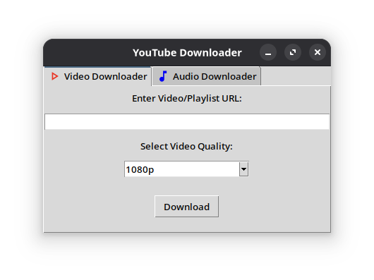
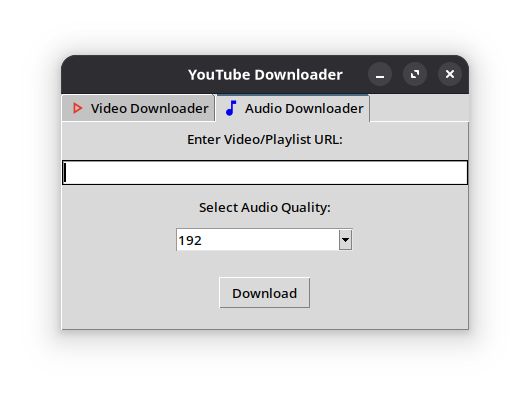

# Pytube Downloader - Youtube Downloader Application

**Version**: 1.2.1

**Author**: Joa98






Python-based application built with moviepy, Tkinter and yt-dlp, where you can download videos and audio files from the YouTube website.

## Features

* Download videos and choose its quality
    * 1080p - (default)
    * 720p
    * 480p
    * 360p
* Download audios and choose its quality
    * 320
    * 256
    * 192 - (default)
    * 128
* Download videos and audios playlists.
* Never stores any users data.

## Requirements

* **Python 3.10+**
* **moviepy** and **yt-dlp** - (installed via `requirements.txt`)
* Linux/Windows/macOS

## Installation

### Linux (Debian/Ubuntu)

```
# Install Python and Git
sudo apt update && sudo apt install python3 python3-pip git
cd Pytube_Downloader

# Clone the repository
git clone https://github.com/Joa98Dev/pytube-downloader.git

# Set up a virtual envrionments
Python3 -m venv
source venv/bin/activate

# Install dependencies
pip install -r requirements.txt

# Run the app
python main.py
```

### Linux (Arch)

```
# Install Python and Git
sudo pacman -S python python-pip git

# Clone the repository
git clone https://github.com/Joa98Dev/pytube-downloader.git
cd Pytube_Downloader

# Set up a virtual environment
python -m venv venv
source venv/bin/activate

# Install dependencies
pip install -r requirements.txt

# Run the app
python main.py
```

### Windows 10/11

```
# Install Python from https://python.org (check "Add to PATH" during installation)
# Open CMD/PowerShell as Administrator

# Clone the repo
git clone https://github.com/Joa98Dev/pytube-downloader.git
cd Pytube_Downloader

# Set up a virtual environment
python -m venv venv
venv\Scripts\activate

# Install dependencies
pip install -r requirements.txt

# Run the app
python main.py
```

### macOS

```
# Install Homebrew (if not installed)
/bin/bash -c "$(curl -fsSL https://raw.githubusercontent.com/Homebrew/install/HEAD/install.sh)"

# Install Python and Git
brew install python git

# Clone the repo
git clone https://github.com/Joa98Dev/pytube-downloader.git
cd Pytube_Downloader

# Set up a virtual environment
python3 -m venv venv
source venv/bin/activate

# Install dependencies
pip install -r requirements.txt

# Run the app
python3 main.py
```

## How to use it?

1. Open the Pytube Downloader App
2. Copy the url of the video that you want to downloader
3. Paste the link on the video tab or audio tab.
4. Press the **Download** button
5. Wait until the app finish the download.
6. Done!
